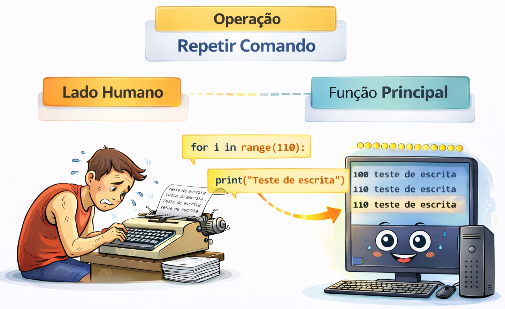
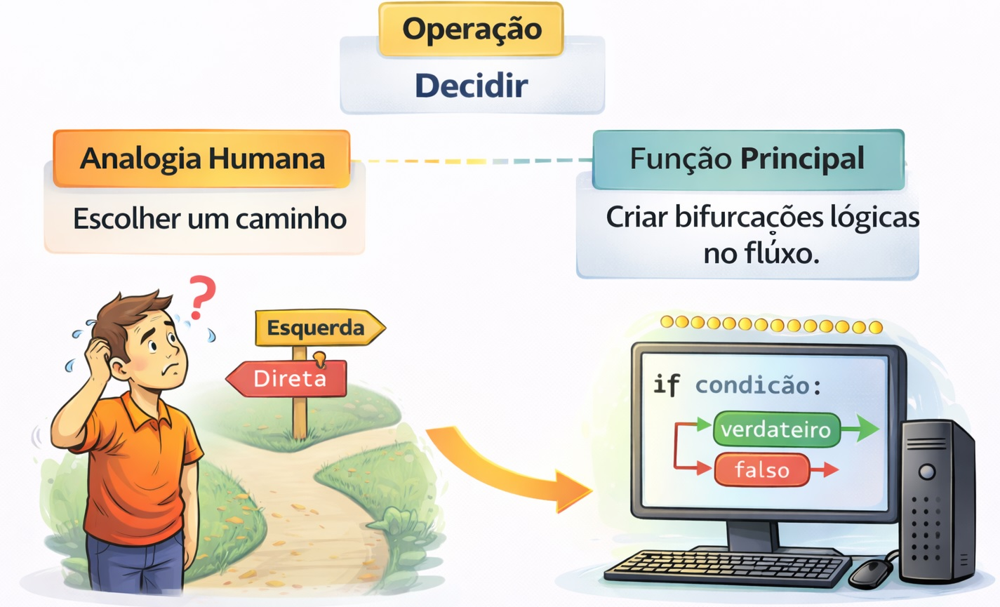

# Estudo Detalhado: Estruturas de Repetição e Estruturas de Controle 

## ESTRUTURAS DE REPETIÇÃO



Computadores são ótimos em fazer tarefas repetitivas sem reclamar. Em vez de escrever o mesmo código dez vezes, usamos um laço (loop) que executa o bloco de comandos enquanto uma condição for mantida.

-   **Tipos comuns:** `while` (enquanto) e `for` (para).

-   **Exemplo:** Listar todos os nomes de uma lista de contatos ou repetir um alerta até que o usuário clique em "OK".

### O Laço WHILE ("enquanto")

Utilizado quando não sabemos exatamente quantas vezes o código será executado, mas sabemos a condição de parada.

Pode criar a repetição ifinitamente, caso a condição de parada ninca for falsa.

``` python

contador = 1

while contador <= 5:
    print(f"Repetição número {contador}")
    contador += 1  # Incremento fundamental
```

### O Laço FOR ("para cada")

Em Python, o for é muito potente pois ele percorre sequências (listas, strings, intervalos). É a forma mais comum de computar (iterar) sobre dados.

``` python
# Exemplo com lista

frutas = ["Maçã", "Banana", "Uva"]

for fruta in frutas:
    print(f"Eu gosto de {frutas}")
```

OBS: aqui vamos usar também a função RANGE() que gera uma sequência de 0 a 4.

``` python

# Exemplo utilizando a função range

for meu_contador in range(5):
    print(f"Índice: {meu_contador}")

```

## ESTRUTURAS DE CONTROLE



A inteligência de um código nasce aqui. Essa operação permite que o programa tome caminhos diferentes baseando-se em uma condição lógica (verdadeira ou falsa).

-   **Lógica:** **SE** (condição) então faça A; **SENÃO**, faça B.

-   **Exemplo:** Se a nota for maior que 7, o aluno está "Aprovado"; caso contrário, "Reprovado".

    ``` python
    # 1. Recebe a nota (usamos float para permitir números com vírgula, como 7.5)

    nota = float(input("Digite a nota do aluno: "))

    # 2. Verifica a condição de aprovação

    if nota > 7:
        print("Aprovado")
    else:
        print("Reprovado")
    ```

```{r 03-estrutura-controle-repeticao, eval=FALSE, include=FALSE}
rmarkdown::render("03-2026-03-11_Estruturas_de_Controle-01.Rmd", output_dir="docs", output_file ="temporario.html" , output_format = "html_document") ; utils::browseURL("docs/temporario.html")
```
